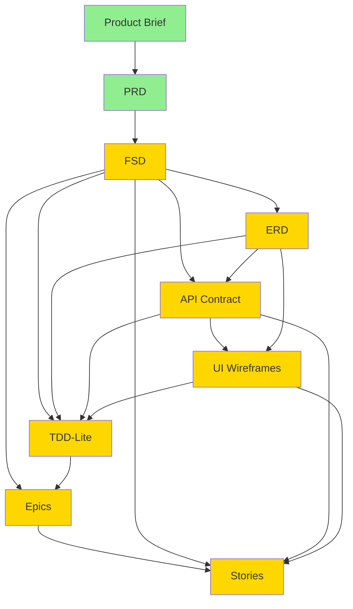

# Design: MVP Documentation Suite Architecture

## Change ID
`create-mvp-documentation-suite`

## Overview
This design document captures the architectural decisions, patterns, and trade-offs for creating the complete documentation suite (FSD, ERD, API Contract, UI Wireframes, TDD-Lite, Epics, Stories) that translates the Dif an-DIOS PRD into implementation-ready specifications.

## Problem Space

### Documentation Gap Analysis

Currently, the Difan-DIOS project has:
- ✅ **Product Brief**: High-level business vision (executive summary)
- ✅ **PRD**: Comprehensive product requirements with 25 user stories
- ✅ **Baseline Specs**: 16 capability specifications with 76 requirements (archived from `establish-baseline-specs`)
- ✅ **Architecture Design**: High-level tech stack decisions (Laravel + MySQL + React)
- ⚠️ **Frontend Templates**: Complete HTML/CSS/jQuery templates (not yet integrated with backend)
- ⚠️ **Backend Scaffolding**: Laravel project structure exists but no implementation

**Missing Documentation** (per Prompter canonical flow):
```
Product Brief → PRD → [FSD] → [ERD] → [API Contract] → [UI Wireframes] → [TDD-Lite] → [Epics] → [Stories]
```

Without these bridge documents:
1. **Developers cannot begin implementation** - No database schema, API contracts, or UI specifications
2. **Teams cannot work in parallel** - Frontend needs API contract to develop against; backend needs ERD to implement
3. **Quality cannot be validated** - No acceptance criteria or testable specifications
4. **Work cannot be estimated** - No granular tasks to estimate effort
5. **Progress cannot be tracked** - No epics or stories to measure completion

### User Stories Requiring Translation

The PRD contains 25 user stories spanning 8 categories:
1. **Authentication & User Management** (US-01 to US-04): 4 stories
2. **Document Creation & Management** (US-05 to US-09): 5 stories
3. **Approval Workflows** (US-10 to US-14): 5 stories
4. **Work Order Management** (US-15 to US-17): 3 stories
5. **Meeting Room Booking** (US-18 to US-20): 3 stories
6. **Dashboard & Analytics** (US-21 to US-23): 3 stories
7. **Audit & Compliance** (US-24 to US-25): 2 stories

These user stories must be translated into:
- Functional requirements (FSD)
- Data models (ERD)
- API endpoints (API Contract)
- UI screens (UI Wireframes)
- Implementation tasks (Epics & Stories)

## Documentation Architecture

### Document Dependency Graph



Legend:
- **Green**: Documents that exist
- **Yellow**: Documents to be created in this change

### Creation Sequence

**Phase 1: Foundation** (Sequential - Cannot Parallelize)
1. **FSD First**: Must complete FSD before ERD, API Contract, because FSD defines functional requirements that drive data and interface needs
2. **ERD Next**: Must complete ERD before API Contract and UI Wireframes, because data model determines API response schemas and UI data fields

**Phase 2: Interface Documents** (Can Parallelize After Phase 1)
3. **API Contract**: Can start after FSD + ERD complete (backend team)
4. **UI Wireframes**: Can start after FSD + ERD complete (frontend team)
   - API Contract and UI Wireframes can be developed in parallel by separate team members

**Phase 3: Implementation Guidance** (Must Wait for Phase 2)
5. **TDD-Lite**: Requires FSD, ERD, API Contract, UI Wireframes to provide implementation patterns for all components

**Phase 4: Work Breakdown** (Must Wait for Phase 3)
6. **Epics**: Requires FSD and TDD-Lite to group features into releasable increments
7. **Stories**: Requires all documents (FSD, ERD, API Contract, UI Wireframes, TDD-Lite, Epics) to break down into atomic tasks

### Document Scope Definitions

#### Functional Specification Document (FSD)
**Purpose**: Define detailed functional behavior, business rules, and validation logic

**Content Scope**:
- Functional requirements for all 16 capabilities
- Business rules (e.g., "Password must have 8+ characters with uppercase, lowercase, number, special character")
- Validation rules (e.g., "Effective date cannot be in the past")
- Workflow state machines (document lifecycle, work order status flow)
- Error handling and edge cases
- Cross-cutting concerns (search, filtering, export)

**Content NOT in Scope**:
- ❌ Database schema details (belongs in ERD)
- ❌ API endpoint definitions (belongs in API Contract)
- ❌ UI screen layouts (belongs in UI Wireframes)
- ❌ Implementation code or patterns (belongs in TDD-Lite)

**Format**: Markdown with:
- Hierarchical sections (## Capability → ### Requirement → #### Business Rule)
- Given/When/Then scenarios for behavior specification
- State machine diagrams (Mermaid)
- Validation rule tables

**Size Estimate**: 80-100 pages

---

#### Entity Relationship Diagram (ERD)
**Purpose**: Define complete data model for MySQL database

**Content Scope**:
- 20+ entity definitions (User, Role, Department, Document, SOP, Policy, WorkOrder, etc.)
- Field definitions (name, type, constraints, nullability, defaults)
- Relationships (one-to-many, many-to-many, polymorphic)
- Foreign keys and cascading behavior
- Indexes for performance
- Soft delete strategy (deleted_at column)
- Audit fields (created_at, updated_at, created_by, updated_by)

**Content NOT in Scope**:
- ❌ Business logic or validation rules (belongs in FSD)
- ❌ API response formats (belongs in API Contract)
- ❌ Migration files (created during implementation)

**Format**: Markdown with:
- Mermaid ER diagram for visual representation
- Detailed entity tables (field name, type, constraints, description)
- Relationship definitions with cardinality

**Size Estimate**: 40-50 pages

**Design Decisions**:

**Decision 1: Document Inheritance Strategy**

**Options**:
1. **Single Table Inheritance (STI)**: One `documents` table with `type` column (SOP, Policy, etc.)
2. **Polymorphic Relations**: Base `documents` table + separate `sops`, `policies` tables linked via polymorphic relations
3. **Separate Tables**: Completely separate tables for SOPs, Policies, etc. with shared fields duplicated

**Chosen**: **Option 1 - Single Table Inheritance (STI)** with type-specific JSON fields

**Rationale**:
- ✅ Simpler schema (one documents table)
- ✅ Easier to query across all document types (compliance reports, search)
- ✅ Laravel Eloquent has built-in STI support
- ✅ Type-specific fields stored in JSON column (flexible for different document types)
- ⚠️ Potential for sparse table (many NULL columns for type-specific fields)
- Mitigation: Use JSON columns for type-specific data to minimize NULLs

**Alternative Considered**: Option 2 was close contender, but added complexity with polymorphic relations for minimal benefit

---

**Decision 2: Soft Delete Strategy**

**Question**: Which entities should have soft deletes (`deleted_at` column)?

**Chosen**: Soft delete on:
- ✅ **Documents** (SOPs, Policies, etc.) - Compliance requirement (audit trail)
- ✅ **Users** - Cannot fully delete users with audit log references
- ✅ **Work Orders** - May need to restore cancelled work orders
- ✅ **Approvals** - Part of audit trail
- ❌ **Audit Logs** - Never delete (immutable)
- ❌ **Notifications** - Can be hard-deleted after retention period
- ❌ **Meeting Rooms** - Use `is_active` flag instead (room always exists, just disabled)

**Rationale**:
- Documents must retain history for ISO compliance
- Users cannot be fully deleted if referenced in audit logs
- Work orders may need to be restored
- Audit logs are immutable (never soft-delete)

---

#### API Contract
**Purpose**: Define RESTful API endpoints for frontend-backend communication

**Content Scope**:
- 100+ endpoint definitions (authentication, users, documents, workflows, etc.)
- HTTP methods (GET, POST, PUT, PATCH, DELETE)
- Request schemas (JSON format with field types, validation rules)
- Response schemas (JSON format with field types)
- Error response formats (4xx, 5xx with error codes)
- Pagination patterns
- Authentication requirements (Laravel Sanctum token-based)
- Rate limiting specifications

**Content NOT in Scope**:
- ❌ Implementation code (belongs in backend implementation)
- ❌ UI screens that consume APIs (belongs in UI Wireframes)
- ❌ Database queries (implementation detail)

**Format**: Markdown with:
- Hierarchical sections (## Module → ### Endpoint)
- Request/response JSON schemas with syntax highlighting
- Example payloads for clarity
- Error code tables

**Size Estimate**: 60-80 pages

**Design Decisions**:

**Decision 3: API Versioning Strategy**

**Options**:
1. **Versioned URLs**: `/api/v1/users`, `/api/v2/users`
2. **Header-based**: `Accept: application/vnd.dios.v1+json`
3. **No versioning initially**: `/api/users` (add versioning when breaking changes needed)

**Chosen**: **Option 3 - No versioning initially** (defer until breaking changes needed)

**Rationale**:
- ✅ Simpler for MVP 1 (single frontend consuming API, low risk of breaking changes)
- ✅ Can add versioning later via Option 1 (URL-based) when needed
- ✅ Reduces boilerplate in initial implementation
- ⚠️ Risk: Breaking changes require API version upgrade later
- Mitigation: Document commitment to backward compatibility for MVP 1; introduce versioning in Phase 2 if needed

---

**Decision 4: Pagination Format**

**Options**:
1. **Offset-based**: `GET /api/users?page=1&per_page=20` → response has `{data: [...], pagination: {page, per_page, total}}`
2. **Cursor-based**: `GET /api/users?cursor=abc123&limit=20` → response has `{data: [...], next_cursor}`
3. **Link header**: Response includes `Link` header with `next`, `prev`, `first`, `last` URLs

**Chosen**: **Option 1 - Offset-based pagination**

**Rationale**:
- ✅ Laravel Eloquent's default pagination pattern (`paginate()` method)
- ✅ Easier for frontend to implement (page number-based UI common)
- ✅ Supports jumping to arbitrary pages (useful for admin interfaces)
- ⚠️ Slower for large datasets vs. cursor-based
- Mitigation: For large datasets (audit logs), consider cursor-based in future; MVP 1 datasets small enough for offset-based

---

#### UI Wireframes
**Purpose**: Define screen layouts, user flows, and interaction patterns

**Content Scope**:
- Screen layouts for all 25 PRD user stories
- Component specifications (forms, tables, modals, navigation)
- Responsive behavior (desktop, tablet, mobile breakpoints)
- User interaction patterns (click, hover, keyboard)
- Error states and loading indicators
- Navigation flows between screens

**Content NOT in Scope**:
- ❌ Visual design (colors, fonts, exact spacing) - Deferred to Figma/design tool
- ❌ React component code (belongs in implementation)
- ❌ Backend API calls (documented in API Contract)

**Format**: Markdown with:
- ASCII/text-based wireframe diagrams
- Mermaid sequence diagrams for user flows
- Component specification tables
- References to existing templates in `template/` directory

**Size Estimate**: 60-80 pages

**Design Decisions**:

**Decision 5: Wireframe Fidelity Level**

**Options**:
1. **High-fidelity**: Detailed visual designs with exact spacing, colors (requires design tool like Figma)
2. **Medium-fidelity**: Layout blocks with component types specified (ASCII/text diagrams)
3. **Low-fidelity**: Simple flowcharts and text descriptions

**Chosen**: **Option 2 - Medium-fidelity** (layout blocks with ASCII/Mermaid diagrams)

**Rationale**:
- ✅ Sufficient detail for React component development without requiring design tool expertise
- ✅ Stays within Markdown format (aligns with Prompter documentation framework)
- ✅ Can reference existing templates (`template/*.html`) for visual guidance
- ✅ Faster to create than high-fidelity designs
- ⚠️ May require design refinement before final UI
- Mitigation: Wireframes serve as blueprint; UX designer can refine into high-fidelity designs if needed (out of scope for this change)

---

**Decision 6: Mobile-First vs. Desktop-First Wireframes**

**Options**:
1. **Mobile-first**: Design for mobile, then adapt for desktop
2. **Desktop-first**: Design for desktop, then adapt for mobile
3. **Responsive**: Design all breakpoints (mobile, tablet, desktop) simultaneously

**Chosen**: **Option 2 - Desktop-first** with mobile responsive patterns documented

**Rationale**:
- ✅ Existing templates are desktop-first (align with current implementation)
- ✅ Primary users are office workers (desktop-focused use case per PRD)
- ✅ Mobile optimization documented as responsive behavior (not complete redesign)
- ⚠️ Risk: Mobile experience may feel like "shrunk desktop"
- Mitigation: Document mobile-specific patterns (bottom nav, swipe gestures) for key workflows; Phase 2 can introduce fully optimized mobile UI if needed

---

#### Technical Design Document (TDD-Lite)
**Purpose**: Provide implementation patterns and technology-specific guidance

**Content Scope**:
- Implementation patterns for key features (approval workflow engine, version control, file storage, search)
- Technology-specific decisions (Laravel middleware, Eloquent patterns, React component architecture)
- Performance optimization strategies
- Security implementation patterns
- Caching and background job patterns

**Content NOT in Scope**:
- ❌ High-level architecture (already documented in baseline design.md)
- ❌ Detailed code (belongs in implementation)
- ❌ Infrastructure and deployment (separate DevOps documentation)

**Format**: Markdown with:
- Implementation pattern descriptions
- Code examples (pseudocode or simplified snippets)
- Decision matrices (trade-offs)
- Diagrams (Mermaid sequence/flow diagrams)

**Size Estimate**: 40-50 pages

**Design Decisions**:

**Decision 7: Approval Workflow Implementation Pattern**

**Options**:
1. **Database-driven state machine**: States and transitions stored in database, engine reads configuration
2. **Code-based state machine**: States and transitions hardcoded in Laravel (using state machine library like `spatie/laravel-model-states`)
3. **Hybrid**: Core states in code, configuration (approval levels) in database

**Chosen**: **Option 3 - Hybrid** (core state machine in code, configurable levels in database)

**Rationale**:
- ✅ Core states (draft, submitted, in review, approved, rejected) are stable (low change frequency)
- ✅ Approval levels are configuration (per document type, may change) → database
- ✅ Code provides structure and validation, database provides flexibility
- ✅ Easier to test and debug than fully database-driven
- ⚠️ Requires code changes to add new states (low risk for MVP 1)
- Mitigation: Core states are well-defined in PRD and unlikely to change; if new states needed in future, code update is acceptable

---

**Decision 8: React State Management**

**Options**:
1. **Redux**: Centralized global state management
2. **React Context API**: Native React context for global state
3. **Local State Only**: Component-level state only (useState, useReducer)
4. **Zustand / Jotai**: Lightweight alternative state managers

**Chosen**: **Option 2 - React Context API** for global state (auth state), **Option 3 - Local State** for component state

**Rationale**:
- ✅ Context API sufficient for MVP 1 needs (primarily authentication state)
- ✅ Simpler than Redux (less boilerplate, faster development)
- ✅ Native React solution (no additional dependencies)
- ✅ Can migrate to Redux if complexity grows in Phase 2
- ⚠️ Context API has performance limitations for frequently changing state
- Mitigation: Use Context only for infrequently changing global state (auth); local state for forms, UI toggles; consider Redux in Phase 2 if needed

---

**Decision 9: File Upload Strategy**

**Options**:
1. **Direct to S3**: Frontend uploads directly to S3 using pre-signed URLs
2. **Via Backend**: Frontend uploads to Laravel backend, backend stores to S3
3. **Hybrid**: Small files via backend, large files direct to S3

**Chosen**: **Option 2 - Via Backend** initially (Phase 1), migrate to Option 1 for large files in Phase 2

**Rationale**:
- ✅ Simpler for MVP 1 (single upload flow, easier virus scanning at backend)
- ✅ Backend controls access (user must be authenticated)
- ✅ Laravel Storage abstraction allows easy migration to S3 later (configuration change)
- ⚠️ Backend becomes bottleneck for large file uploads
- ⚠️ Higher bandwidth cost (file traverses backend)
- Mitigation: MVP 1 file size limit (10MB) keeps uploads manageable; Phase 2 can introduce direct S3 upload for performance optimization

---

#### Epics
**Purpose**: Group related features into releasable, trackable increments

**Content Scope**:
- 10-15 epics grouping related user stories and features
- Epic descriptions and goals
- Dependencies between epics
- Rough effort estimates (sprints or story points)

**Content NOT in Scope**:
- ❌ Detailed implementation tasks (belongs in Stories)
- ❌ Sprint assignments (done during sprint planning)

**Format**: Markdown with:
- Epic descriptions
- Feature lists
- Dependency graph (Mermaid)
- Effort estimates

**Size Estimate**: 15-20 pages

---

#### Stories
**Purpose**: Break epics into atomic, implementable, testable tasks

**Content Scope**:
- 100+ stories breaking down all epics
- Story descriptions (title, description, epic parent)
- Acceptance criteria (Given/When/Then)
- Dependencies (blocks/blocked-by)
- Effort estimates (story points or hours)
- Testing requirements

**Content NOT in Scope**:
- ❌ Detailed implementation code (created during implementation)
- ❌ Sprint assignments (done during sprint planning)

**Format**: Markdown with:
- Story tables or lists
- Acceptance criteria in Given/When/Then format
- Traceability matrix (PRD User Story → Epic → Stories)

**Size Estimate**: 60-80 pages (100+ stories)

**Design Decisions**:

**Decision 10: Story Granularity**

**Options**:
1. **Coarse-grained**: Large stories (1-2 weeks effort each)
2. **Fine-grained**: Small stories (1-2 days effort each)
3. **Mixed**: Large stories for complex features, small for simple ones

**Chosen**: **Option 2 - Fine-grained** (target 1-3 days per story)

**Rationale**:
- ✅ Enables daily progress tracking
- ✅ Reduces risk of story carrying over across sprints
- ✅ Easier to estimate (less uncertainty)
- ✅ Better for distributed teams (smaller units of work)
- ⚠️ More stories to manage
- Mitigation: Use epics to group related stories; prioritize and sequence stories within epics

---

## Traceability Architecture

### Traceability Matrix Design

**Purpose**: Ensure every PRD user story is implemented (no gaps)

**Format**: Table mapping:

| PRD User Story | FSD Requirements | ERD Entities | API Endpoints | UI Screens | Epic | Stories |
|----------------|------------------|--------------|---------------|------------|------|---------|
| US-01: User Login | AUTH-001, AUTH-002, AUTH-003 | User, AuditLog | POST /api/auth/login, GET /api/auth/logout | Login Page | Epic 1 | 1.1-1.5 |
| US-02: Create User | AUTH-004, AUTHZ-001 | User, Role, Department | POST /api/users | User Management Page | Epic 1 | 1.6-1.8 |
| ... | ... | ... | ... | ... | ... | ... |

**Validation**: Every row must have entries in all columns (complete traceability)

---

## Cross-Cutting Concerns

### Documentation Quality Standards

**Consistency Requirements**:
- All documents use consistent terminology (defined in AGENTS.md Section 7: Glossary)
- All documents follow Markdown formatting conventions
- All diagrams use Mermaid when possible (for consistency and version control)
- All scenarios use Given/When/Then format

**Review Checkpoints**:
- FSD reviewed by product owner and tech lead before ERD starts
- ERD reviewed by database administrator before API Contract starts
- API Contract reviewed by backend and frontend leads
- UI Wireframes reviewed by frontend lead and UX designer (if available)
- TDD-Lite reviewed by tech lead
- Epics and Stories reviewed by product owner and development team

**Validation Process**:
- Run `prompter validate create-mvp-documentation-suite --strict` after each document creation
- Resolve all validation errors before proceeding to next document
- Final validation after all documents complete
- Stakeholder approval required before marking proposal as approved

---

## Risks & Mitigations

| Risk | Impact | Mitigation |
|------|--------|------------|
| **Spec Drift** (specs become outdated as code evolves) | High | Specs are source of truth; code changes require spec updates via Prompter change proposals |
| **Over-specification** (too much detail slows down implementation) | Medium | Focus on MVP 1 scope only; defer Phase 2 details; use templates for consistency |
| **Under-specification** (missing details cause implementation ambiguity) | Medium | Thorough review by stakeholders; validation checklists; traceability matrix ensures completeness |
| **Inconsistencies** (FSD, ERD, API Contract, UI Wireframes contradict each other) | High | Cross-document validation (Task 9); automated validation via `prompter validate --strict` |
| **ERD Changes During Implementation** (database schema evolves) | Medium | ERD review by database administrator upfront; allow minor revisions via change proposals |
| **API Contract Incompatibility with Laravel** | Low | Backend lead reviews API Contract; align with Laravel resource controller conventions |
| **Wireframes Don't Match Templates** | Medium | Extensive referencing of `template/*.html` files; document intentional divergences |

---

## Success Metrics

**Completion Metrics**:
- 7 documents created (FSD, ERD, API Contract, UI Wireframes, TDD-Lite, Epics, Stories)
- 100% traceability (all 25 PRD user stories mapped to implementation stories)
- Zero Prompter validation errors
- All reviewers approve their respective documents

**Quality Metrics**:
- FSD covers all 16 capabilities with detailed business rules
- ERD includes 20+ entities with complete field definitions
- API Contract defines 100+ endpoints with schemas
- UI Wireframes cover all screens for 25 user stories
- Epics group work into 10-15 releasable increments
- Stories provide atomic tasks with acceptance criteria

**Adoption Metrics** (Post-Implementation):
- Backend developers reference ERD and API Contract daily
- Frontend developers reference UI Wireframes and API Contract daily
- QA team uses Stories for test case creation
- Product owner uses Epics for progress tracking

---

## Appendices

### A. Document Templates

**FSD Section Template**:
```markdown
### Requirement: [Requirement Name]

[Description of functional requirement]

*ID: [CAPABILITY]-[NUMBER]*

#### Scenario: [Scenario Description]
- GIVEN [preconditions]
- WHEN [action/event]
- THEN [expected outcome]
- AND [additional outcomes]
```

**ERD Entity Template**:
```markdown
#### Entity: [EntityName]

**Description**: [Purpose of this entity]

**Fields**:
| Field Name | Type | Constraints | Description |
|------------|------|-------------|-------------|
| id | BIGINT UNSIGNED | PK, AUTO_INCREMENT | Primary key |
| name | VARCHAR(255) | NOT NULL | Entity name |
| ... | ... | ... | ... |

**Relationships**:
- Belongs to [RelatedEntity] (Many-to-One via [foreign_key_field])
- Has many [RelatedEntity] (One-to-Many)

**Indexes**:
- PRIMARY KEY (id)
- INDEX idx_[field] ([field])
```

**API Endpoint Template**:
```markdown
### [HTTP METHOD] [Endpoint URL]

**Description**: [What this endpoint does]

**Authentication**: Required / Not Required

**Request**:
```json
{
  "field": "value",
  "field2": 123
}
```

**Response** (200 OK):
```json
{
  "success": true,
  "data": {
    "id": 1,
    "field": "value"
  }
}
```

**Errors**:
- 400 Bad Request: [Validation failure scenarios]
- 401 Unauthorized: [Authentication required]
- 403 Forbidden: [Insufficient permissions]
```

### B. Reference Documents

- **Product Brief**: `prompter/difan-dios/product-brief.md`
- **PRD**: `prompter/difan-dios/prd.md`
- **Baseline Specs**: `prompter/specs/[capability]/spec.md` (16 capabilities)
- **Architecture Design**: `prompter/changes/archive/2026-02-10-establish-baseline-specs/design.md`
- **AGENTS.md**: `AGENTS.md` and `prompter/AGENTS.md` (project conventions)

---

**Change ID**: `create-mvp-documentation-suite`  
**Document Type**: Design Document  
**Version**: 1.0.0  
**Date**: February 10, 2026  
**Status**: 🟡 Proposed
