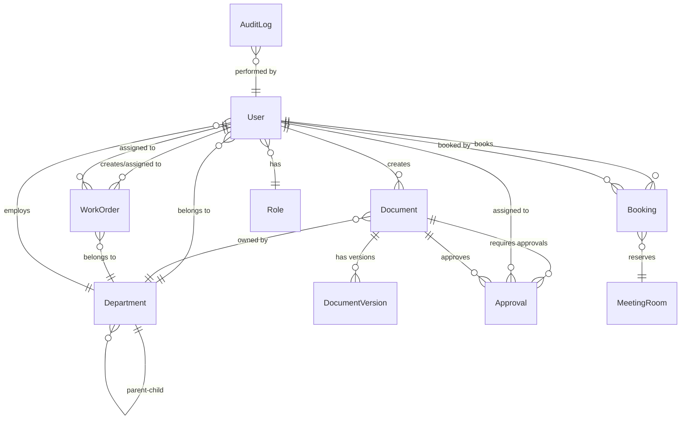

# Entity Relationship Diagram (ERD)

## Document Information

|                        |                                |
|------------------------|--------------------------------|
| **Project**            | Difan-DIOS (Difan Integrated Operational System) |
| **Version**            | 1.0.0 (DRAFT - TEMPLATE)       |
| **Date**               | February 10, 2026              |
| **Status**             | 🟡 Template - Awaiting Content |
| **Author**             | TBD                            |
| **Reviewers**          | Database Administrator, Tech Lead |
| **Dependencies**       | FSD must be complete           |
| **Technology**         | MySQL 8.x with InnoDB engine   |

---

## 1. Introduction

### 1.1 Purpose
<!-- Describe the purpose of this ERD: to define the complete data model for Difan-DIOS MVP 1 -->

### 1.2 Scope
<!-- Define what entities are included in MVP 1 database schema -->

### 1.3 Database Technology
- **RDBMS**: MySQL 8.x
- **Engine**: InnoDB (ACID transactions)
- **ORM**: Laravel Eloquent
- **Migrations**: Laravel migration system

### 1.4 Reference Documents
- FSD: `prompter/difan-dios/fsd.md`
- PRD: `prompter/difan-dios/prd.md`
- Architecture Design: Archived baseline-specs change `design.md`

---

## 2. Entity Relationship Overview

### 2.1 ER Diagram (Mermaid)

### 2.2 Entity Categories

**Core Entities** (User Management):
- User
- Role
- Permission
- Department

**Document Entities** (Content Management):
- Document (base table)
- SOP (extends Document)
- Policy (extends Document)
- WorkInstruction (extends Document)
- QualityManual (extends Document)
- ApplicationGuide (extends Document)
- DocumentVersion

**Workflow Entities**:
- Approval
- ApprovalLevel
- WorkflowConfiguration

**Operational Entities**:
- WorkOrder
- WorkOrderComment
- MeetingRoom
- Booking
- CustomerRequest
- Form

**Organizational Entities**:
- OrganizationalStructure
- Jobdesk

**Audit Entities**:
- AuditLog
- Notification

**File Management**:
- FileAttachment

---

## 3. Core Entities

### 3.1 User

**Purpose**: Stores user account information for authentication and personalization.

**Table Name**: `users`

| Column | Type | Nullable | Default | Constraints | Description |
|--------|------|----------|---------|-------------|-------------|
| `id` | BIGINT UNSIGNED | NO | AUTO_INCREMENT | PRIMARY KEY | User unique identifier |
| `username` | VARCHAR(100) | NO | - | UNIQUE, INDEX | Login username |
| `email` | VARCHAR(255) | NO | - | UNIQUE, INDEX | Email address |
| `email_verified_at` | TIMESTAMP | YES | NULL | - | Email verification timestamp |
| `password_hash` | VARCHAR(255) | NO | - | - | Bcrypt hashed password |
| `full_name` | VARCHAR(255) | NO | - | - | User's full display name |
| `role_id` | BIGINT UNSIGNED | NO | - | FOREIGN KEY → roles.id, INDEX | User's primary role |
| `department_id` | BIGINT UNSIGNED | YES | NULL | FOREIGN KEY → departments.id, INDEX | User's department |
| `is_active` | BOOLEAN | NO | TRUE | INDEX | Account active status |
| `failed_login_attempts` | INT UNSIGNED | NO | 0 | - | Failed login counter |
| `locked_until` | TIMESTAMP | YES | NULL | - | Account lockout expiry |
| `last_login` | TIMESTAMP | YES | NULL | - | Last successful login |
| `created_at` | TIMESTAMP | NO | CURRENT_TIMESTAMP | - | Account creation timestamp |
| `updated_at` | TIMESTAMP | NO | CURRENT_TIMESTAMP ON UPDATE | - | Last update timestamp |
| `deleted_at` | TIMESTAMP | YES | NULL | INDEX | Soft delete timestamp |

**Indexes**:
- PRIMARY KEY: `id`
- UNIQUE: `username`, `email`
- INDEX: `role_id`, `department_id`, `is_active`, `deleted_at`

**Relationships**:
- `role_id` → `roles.id` (Many-to-One)
- `department_id` → `departments.id` (Many-to-One)
- Has many: `documents`, `approvals`, `work_orders`, `bookings`, `audit_logs`

**Business Rules**:
- Username must be unique and 3-50 characters
- Email must be valid format
- Password must meet complexity requirements (AUTH-001)
- Account locked after 5 failed login attempts for 15 minutes (AUTH-002)

**Notes**:
- [TBD - OQ-01: Soft delete strategy - `deleted_at` included here, confirm for other entities]
- [TBD - Multiple roles per user? If yes, need `user_roles` pivot table]

---

### 3.2 Role

**Purpose**: Defines user roles for RBAC (8 roles: Admin, Quality Manager, Dept Head, Doc Controller, Approver, Staff, Auditor, Guest).

**Table Name**: `roles`

| Column | Type | Nullable | Default | Constraints | Description |
|--------|------|----------|---------|-------------|-------------|
| `id` | BIGINT UNSIGNED | NO | AUTO_INCREMENT | PRIMARY KEY | Role unique identifier |
| `name` | VARCHAR(100) | NO | - | UNIQUE | Role name (e.g., "Administrator") |
| `slug` | VARCHAR(100) | NO | - | UNIQUE, INDEX | Role slug (e.g., "admin") |
| `description` | TEXT | YES | NULL | - | Role description |
| `permissions` | JSON | YES | NULL | - | Permission flags JSON |
| `is_active` | BOOLEAN | NO | TRUE | - | Role active status |
| `created_at` | TIMESTAMP | NO | CURRENT_TIMESTAMP | - | Creation timestamp |
| `updated_at` | TIMESTAMP | NO | CURRENT_TIMESTAMP ON UPDATE | - | Last update timestamp |

**Indexes**:
- PRIMARY KEY: `id`
- UNIQUE: `name`, `slug`
- INDEX: `slug`

**Relationships**:
- Has many: `users`

**Business Rules**:
- Roles defined per AGENTS.md Section 8
- Permissions JSON structure: [TBD - define schema, e.g., {"documents": {"create": true, "approve": false}}]

---

### 3.3 Department

**Purpose**: Organizational structure for document ownership and user assignment.

**Table Name**: `departments`

| Column | Type | Nullable | Default | Constraints | Description |
|--------|------|----------|---------|-------------|-------------|
| `id` | BIGINT UNSIGNED | NO | AUTO_INCREMENT | PRIMARY KEY | Department unique identifier |
| `name` | VARCHAR(255) | NO | - | INDEX | Department name |
| `code` | VARCHAR(50) | NO | - | UNIQUE, INDEX | Department code |
| `parent_id` | BIGINT UNSIGNED | YES | NULL | FOREIGN KEY → departments.id, INDEX | Parent department (for hierarchy) |
| `head_user_id` | BIGINT UNSIGNED | YES | NULL | FOREIGN KEY → users.id | Department head |
| `description` | TEXT | YES | NULL | - | Department description |
| `is_active` | BOOLEAN | NO | TRUE | - | Active status |
| `created_at` | TIMESTAMP | NO | CURRENT_TIMESTAMP | - | Creation timestamp |
| `updated_at` | TIMESTAMP | NO | CURRENT_TIMESTAMP ON UPDATE | - | Last update timestamp |
| `deleted_at` | TIMESTAMP | YES | NULL | INDEX | Soft delete timestamp |

**Indexes**:
- PRIMARY KEY: `id`
- UNIQUE: `code`
- INDEX: `parent_id`, `head_user_id`, `name`, `deleted_at`

**Relationships**:
- `parent_id` → `departments.id` (Self-referencing, Many-to-One for hierarchy)
- `head_user_id` → `users.id` (Many-to-One)
- Has many: `users`, `documents`, `work_orders`

**Business Rules**:
- Department codes must be unique
- Hierarchy depth: [TBD - max 5 levels?]
- Cannot delete department with active documents/users (soft delete only)

---

## 4. Document Entities

### 4.1 Document (Base Table)

**Purpose**: Base table for all document types (SOP, Policy, Work Instruction, Quality Manual, Application Guide).

**Table Name**: `documents`

**Inheritance Strategy**: [TBD - Single Table Inheritance (STI) vs. Concrete Table Inheritance vs. Polymorphic Relations]

| Column | Type | Nullable | Default | Constraints | Description |
|--------|------|----------|---------|-------------|-------------|
| `id` | BIGINT UNSIGNED | NO | AUTO_INCREMENT | PRIMARY KEY | Document unique identifier |
| `document_type` | VARCHAR(50) | NO | - | INDEX | Discriminator: 'sop', 'policy', 'work_instruction', 'quality_manual', 'app_guide' |
| `document_number` | VARCHAR(100) | NO | - | UNIQUE, INDEX | Auto-generated or manual (e.g., SOP-2026-001) |
| `title` | VARCHAR(500) | NO | - | FULLTEXT INDEX | Document title |
| `description` | TEXT | YES | NULL | FULLTEXT INDEX | Document description/summary |
| `content` | LONGTEXT | YES | NULL | - | Rich text content (if not file-based) |
| `category` | VARCHAR(100) | YES | NULL | INDEX | Document category |
| `department_id` | BIGINT UNSIGNED | NO | - | FOREIGN KEY → departments.id, INDEX | Owning department |
| `created_by` | BIGINT UNSIGNED | NO | - | FOREIGN KEY → users.id, INDEX | Creator user |
| `status` | ENUM(...) | NO | 'draft' | INDEX | 'draft', 'submitted', 'in_review', 'approved', 'rejected', 'published', 'archived' |
| `version` | VARCHAR(20) | NO | '1.0' | - | Version number (semantic versioning or sequential) |
| `effective_date` | DATE | YES | NULL | INDEX | When document becomes active |
| `review_date` | DATE | YES | NULL | INDEX | Next scheduled review |
| `expiry_date` | DATE | YES | NULL | INDEX | Document expiration |
| `file_path` | VARCHAR(500) | YES | NULL | - | Path to uploaded file |
| `file_size` | BIGINT UNSIGNED | YES | NULL | - | File size in bytes |
| `file_mime_type` | VARCHAR(100) | YES | NULL | - | File MIME type |
| `created_at` | TIMESTAMP | NO | CURRENT_TIMESTAMP | - | Creation timestamp |
| `updated_at` | TIMESTAMP | NO | CURRENT_TIMESTAMP ON UPDATE | - | Last update timestamp |
| `deleted_at` | TIMESTAMP | YES | NULL | INDEX | Soft delete timestamp |

**Type-Specific Columns** (if using STI):
- `sop_number` | VARCHAR(100) | YES | NULL | - | For SOP documents only
- `scope` | TEXT | YES | NULL | - | For SOP documents
- `procedure_steps` | JSON | YES | NULL | - | For SOP documents
- `policy_number` | VARCHAR(100) | YES | NULL | - | For Policy documents
- `compliance_framework` | VARCHAR(255) | YES | NULL | - | For Policy documents
- [TBD - Add columns for other document types]

**Indexes**:
- PRIMARY KEY: `id`
- UNIQUE: `document_number`
- INDEX: `document_type`, `status`, `department_id`, `created_by`, `effective_date`, `review_date`, `deleted_at`
- FULLTEXT: `title`, `description`

**Relationships**:
- `department_id` → `departments.id` (Many-to-One)
- `created_by` → `users.id` (Many-to-One)
- Has many: `document_versions`, `approvals`, `file_attachments`

**Business Rules**:
- Document number must be unique
- Effective date cannot be in the past for new documents
- Review date must be after effective date
- Status transitions follow state machine (FSD Section 3.3.8)

**Notes**:
- [TBD - Decide on inheritance strategy: STI vs. separate tables per document type]
- [TBD - File storage path convention: `/storage/documents/{year}/{month}/{id}/{filename}`]

---

### 4.2 DocumentVersion

**Purpose**: Store historical versions of documents for audit and comparison.

**Table Name**: `document_versions`

| Column | Type | Nullable | Default | Constraints | Description |
|--------|------|----------|---------|-------------|-------------|
| `id` | BIGINT UNSIGNED | NO | AUTO_INCREMENT | PRIMARY KEY | Version unique identifier |
| `document_id` | BIGINT UNSIGNED | NO | - | FOREIGN KEY → documents.id, INDEX | Parent document |
| `version` | VARCHAR(20) | NO | - | INDEX | Version number |
| `content` | LONGTEXT | YES | NULL | - | Snapshot of document content |
| `file_path` | VARCHAR(500) | YES | NULL | - | Snapshot of file path |
| `changes_summary` | TEXT | YES | NULL | - | Summary of changes in this version |
| `created_by` | BIGINT UNSIGNED | NO | - | FOREIGN KEY → users.id | User who created this version |
| `created_at` | TIMESTAMP | NO | CURRENT_TIMESTAMP | - | Version creation timestamp |

**Indexes**:
- PRIMARY KEY: `id`
- INDEX: `document_id`, `version`

**Relationships**:
- `document_id` → `documents.id` (Many-to-One)
- `created_by` → `users.id` (Many-to-One)

**Business Rules**:
- New version created on each significant edit after publication
- Versions are immutable (never updated or deleted)
- Version numbering strategy: [TBD - semantic (1.0, 1.1, 2.0) or sequential (1, 2, 3)]

---

## 5. Workflow Entities

### 5.1 Approval

**Purpose**: Track approval requests and decisions for documents.

**Table Name**: `approvals`

| Column | Type | Nullable | Default | Constraints | Description |
|--------|------|----------|---------|-------------|-------------|
| `id` | BIGINT UNSIGNED | NO | AUTO_INCREMENT | PRIMARY KEY | Approval unique identifier |
| `document_id` | BIGINT UNSIGNED | NO | - | FOREIGN KEY → documents.id, INDEX | Document being approved |
| `approver_id` | BIGINT UNSIGNED | NO | - | FOREIGN KEY → users.id, INDEX | Assigned approver |
| `approval_level` | INT UNSIGNED | NO | - | INDEX | Approval level (1, 2, 3, etc.) |
| `status` | ENUM(...) | NO | 'pending' | INDEX | 'pending', 'approved', 'rejected', 'delegated' |
| `comments` | TEXT | YES | NULL | - | Approver comments/feedback |
| `delegated_to` | BIGINT UNSIGNED | YES | NULL | FOREIGN KEY → users.id | If delegated, the delegatee user |
| `action_date` | TIMESTAMP | YES | NULL | - | When approval action taken |
| `created_at` | TIMESTAMP | NO | CURRENT_TIMESTAMP | - | Request creation timestamp |
| `updated_at` | TIMESTAMP | NO | CURRENT_TIMESTAMP ON UPDATE | - | Last update timestamp |

**Indexes**:
- PRIMARY KEY: `id`
- INDEX: `document_id`, `approver_id`, `status`, `approval_level`, `delegated_to`

**Relationships**:
- `document_id` → `documents.id` (Many-to-One)
- `approver_id` → `users.id` (Many-to-One)
- `delegated_to` → `users.id` (Many-to-One)

**Business Rules**:
- Approval levels sequence from 1 to N
- All levels must approve for document to be published
- Rejection at any level returns document to draft
- [TBD - Sequential approval (one level at a time) vs. parallel (all levels simultaneously)?]

---

### 5.2 ApprovalLevel

**Purpose**: Configuration for approval levels per document type.

**Table Name**: `approval_levels`

| Column | Type | Nullable | Default | Constraints | Description |
|--------|------|----------|---------|-------------|-------------|
| `id` | BIGINT UNSIGNED | NO | AUTO_INCREMENT | PRIMARY KEY | Configuration identifier |
| `document_type` | VARCHAR(50) | NO | - | INDEX | Document type requiring approval |
| `level` | INT UNSIGNED | NO | - | - | Level number (1, 2, 3, etc.) |
| `role_id` | BIGINT UNSIGNED | NO | - | FOREIGN KEY → roles.id | Role that approves at this level |
| `is_required` | BOOLEAN | NO | TRUE | - | Whether this level is mandatory |
| `created_at` | TIMESTAMP | NO | CURRENT_TIMESTAMP | - | Creation timestamp |
| `updated_at` | TIMESTAMP | NO | CURRENT_TIMESTAMP ON UPDATE | - | Last update timestamp |

**Indexes**:
- PRIMARY KEY: `id`
- INDEX: `document_type`, `level`, `role_id`

**Relationships**:
- `role_id` → `roles.id` (Many-to-One)

**Business Rules**:
- Unique combination of (document_type, level)
- Levels must be sequential (no gaps)
- [TBD - Department-specific approval configurations?]

---

## 6. Operational Entities

### 6.1 WorkOrder

**Purpose**: Task assignment and tracking system.

**Table Name**: `work_orders`

| Column | Type | Nullable | Default | Constraints | Description |
|--------|------|----------|---------|-------------|-------------|
| `id` | BIGINT UNSIGNED | NO | AUTO_INCREMENT | PRIMARY KEY | Work order unique identifier |
| `wo_number` | VARCHAR(100) | NO | - | UNIQUE, INDEX | Work order number |
| `title` | VARCHAR(500) | NO | - | INDEX | Work order title |
| `description` | TEXT | YES | NULL | - | Detailed description |
| `priority` | ENUM(...) | NO | 'medium' | INDEX | 'low', 'medium', 'high', 'critical' |
| `assigned_to` | BIGINT UNSIGNED | YES | NULL | FOREIGN KEY → users.id, INDEX | Assigned user |
| `created_by` | BIGINT UNSIGNED | NO | - | FOREIGN KEY → users.id, INDEX | Requestor |
| `department_id` | BIGINT UNSIGNED | YES | NULL | FOREIGN KEY → departments.id, INDEX | Requesting department |
| `due_date` | DATE | YES | NULL | INDEX | Expected completion date |
| `status` | ENUM(...) | NO | 'new' | INDEX | 'new', 'assigned', 'in_progress', 'on_hold', 'review', 'completed', 'closed', 'cancelled' |
| `completion_notes` | TEXT | YES | NULL | - | Notes on completion |
| `completed_at` | TIMESTAMP | YES | NULL | - | Completion timestamp |
| `created_at` | TIMESTAMP | NO | CURRENT_TIMESTAMP | - | Creation timestamp |
| `updated_at` | TIMESTAMP | NO | CURRENT_TIMESTAMP ON UPDATE | - | Last update timestamp |
| `deleted_at` | TIMESTAMP | YES | NULL | INDEX | Soft delete timestamp |

**Indexes**:
- PRIMARY KEY: `id`
- UNIQUE: `wo_number`
- INDEX: `priority`, `assigned_to`, `created_by`, `department_id`, `status`, `due_date`, `deleted_at`

**Relationships**:
- `assigned_to` → `users.id` (Many-to-One)
- `created_by` → `users.id` (Many-to-One)
- `department_id` → `departments.id` (Many-to-One)
- Has many: `work_order_comments`, `file_attachments`

**Business Rules**:
- Work order number must be unique and auto-generated
- Status transitions follow workflow (FSD Section 3.5.4)
- Cannot close without completing
- [TBD - Overdue work order escalation?]

---

### 6.2 MeetingRoom

**Purpose**: Meeting room resources for booking system.

**Table Name**: `meeting_rooms`

| Column | Type | Nullable | Default | Constraints | Description |
|--------|------|----------|---------|-------------|-------------|
| `id` | BIGINT UNSIGNED | NO | AUTO_INCREMENT | PRIMARY KEY | Room unique identifier |
| `name` | VARCHAR(255) | NO | - | UNIQUE, INDEX | Room name |
| `location` | VARCHAR(255) | YES | NULL | - | Physical location |
| `capacity` | INT UNSIGNED | YES | NULL | - | Maximum occupancy |
| `facilities` | JSON | YES | NULL | - | Available facilities (projector, whiteboard, etc.) |
| `is_active` | BOOLEAN | NO | TRUE | INDEX | Availability status |
| `created_at` | TIMESTAMP | NO | CURRENT_TIMESTAMP | - | Creation timestamp |
| `updated_at` | TIMESTAMP | NO | CURRENT_TIMESTAMP ON UPDATE | - | Last update timestamp |

**Indexes**:
- PRIMARY KEY: `id`
- UNIQUE: `name`
- INDEX: `is_active`

**Relationships**:
- Has many: `bookings`

**Business Rules**:
- Room names must be unique
- Inactive rooms cannot be booked

---

### 6.3 Booking

**Purpose**: Meeting room reservations.

**Table Name**: `bookings`

| Column | Type | Nullable | Default | Constraints | Description |
|--------|------|----------|---------|-------------|-------------|
| `id` | BIGINT UNSIGNED | NO | AUTO_INCREMENT | PRIMARY KEY | Booking unique identifier |
| `room_id` | BIGINT UNSIGNED | NO | - | FOREIGN KEY → meeting_rooms.id, INDEX | Booked room |
| `booked_by` | BIGINT UNSIGNED | NO | - | FOREIGN KEY → users.id, INDEX | User who booked |
| `title` | VARCHAR(500) | NO | - | - | Meeting title |
| `description` | TEXT | YES | NULL | - | Meeting description |
| `start_time` | DATETIME | NO | - | INDEX | Start datetime |
| `end_time` | DATETIME | NO | - | INDEX | End datetime |
| `attendees_count` | INT UNSIGNED | YES | NULL | - | Number of attendees |
| `status` | ENUM(...) | NO | 'confirmed' | INDEX | 'confirmed', 'cancelled', 'completed' |
| `created_at` | TIMESTAMP | NO | CURRENT_TIMESTAMP | - | Booking creation timestamp |
| `updated_at` | TIMESTAMP | NO | CURRENT_TIMESTAMP ON UPDATE | - | Last update timestamp |

**Indexes**:
- PRIMARY KEY: `id`
- INDEX: `room_id`, `booked_by`, `start_time`, `end_time`, `status`
- COMPOSITE INDEX: `(room_id, start_time, end_time)` for conflict detection

**Relationships**:
- `room_id` → `meeting_rooms.id` (Many-to-One)
- `booked_by` → `users.id` (Many-to-One)

**Business Rules**:
- Start time must be before end time
- Cannot overlap with existing bookings for same room (conflict detection)
- [TBD - Minimum/maximum booking duration? Advance booking deadline?]

---

## 7. Audit Entities

### 7.1 AuditLog

**Purpose**: Immutable audit trail of all system actions.

**Table Name**: `audit_logs`

| Column | Type | Nullable | Default | Constraints | Description |
|--------|------|----------|---------|-------------|-------------|
| `id` | BIGINT UNSIGNED | NO | AUTO_INCREMENT | PRIMARY KEY | Log entry unique identifier |
| `entity_type` | VARCHAR(100) | NO | - | INDEX | Type of entity (Document, WorkOrder, User, etc.) |
| `entity_id` | BIGINT UNSIGNED | YES | NULL | INDEX | ID of the entity |
| `action` | VARCHAR(50) | NO | - | INDEX | Action performed (CREATE, UPDATE, DELETE, APPROVE, LOGIN, etc.) |
| `user_id` | BIGINT UNSIGNED | YES | NULL | FOREIGN KEY → users.id, INDEX | User who performed action |
| `old_value` | JSON | YES | NULL | - | Previous state (before change) |
| `new_value` | JSON | YES | NULL | - | New state (after change) |
| `ip_address` | VARCHAR(45) | YES | NULL | - | User's IP address (IPv4 or IPv6) |
| `user_agent` | TEXT | YES | NULL | - | User's browser/client |
| `timestamp` | TIMESTAMP | NO | CURRENT_TIMESTAMP | INDEX | When action occurred |

**Indexes**:
- PRIMARY KEY: `id`
- INDEX: `entity_type`, `entity_id`, `action`, `user_id`, `timestamp`
- COMPOSITE INDEX: `(entity_type, entity_id, timestamp)` for entity history queries

**Relationships**:
- `user_id` → `users.id` (Many-to-One)

**Business Rules**:
- Audit logs are immutable (no updates or deletes)
- All critical actions must be logged (per AGENTS.md Section 10)
- Retention: 7 years for critical logs, 1 year for operational logs

---

### 7.2 Notification

**Purpose**: User notifications (in-app and email queue).

**Table Name**: `notifications`

| Column | Type | Nullable | Default | Constraints | Description |
|--------|------|----------|---------|-------------|-------------|
| `id` | BIGINT UNSIGNED | NO | AUTO_INCREMENT | PRIMARY KEY | Notification unique identifier |
| `user_id` | BIGINT UNSIGNED | NO | - | FOREIGN KEY → users.id, INDEX | Recipient user |
| `type` | VARCHAR(100) | NO | - | INDEX | Notification type (approval_request, document_published, etc.) |
| `title` | VARCHAR(500) | NO | - | - | Notification title |
| `message` | TEXT | NO | - | - | Notification message/body |
| `data` | JSON | YES | NULL | - | Additional data (links, references) |
| `is_read` | BOOLEAN | NO | FALSE | INDEX | Read status |
| `read_at` | TIMESTAMP | YES | NULL | - | When notification was read |
| `email_sent` | BOOLEAN | NO | FALSE | - | Whether email was sent |
| `email_sent_at` | TIMESTAMP | YES | NULL | - | When email was sent |
| `created_at` | TIMESTAMP | NO | CURRENT_TIMESTAMP | INDEX | Notification creation timestamp |

**Indexes**:
- PRIMARY KEY: `id`
- INDEX: `user_id`, `type`, `is_read`, `created_at`

**Relationships**:
- `user_id` → `users.id` (Many-to-One)

**Business Rules**:
- Notifications created for events per FSD Section 3.9
- Email sending handled asynchronously via queue
- [TBD - Notification retention policy? Auto-delete after 90 days?]

---

## 8. Additional Entities

### 8.1 FileAttachment

**Purpose**: Generic file attachments for documents, work orders, etc.

**Table Name**: `file_attachments`

**Implementation**: [TBD - Polymorphic relation or separate foreign keys per entity type?]

| Column | Type | Nullable | Default | Constraints | Description |
|--------|------|----------|---------|-------------|-------------|
| `id` | BIGINT UNSIGNED | NO | AUTO_INCREMENT | PRIMARY KEY | File attachment identifier |
| `attachable_type` | VARCHAR(100) | NO | - | INDEX | Entity type (Document, WorkOrder, etc.) |
| `attachable_id` | BIGINT UNSIGNED | NO | - | INDEX | Entity ID |
| `filename` | VARCHAR(500) | NO | - | - | Original filename |
| `file_path` | VARCHAR(500) | NO | - | - | Storage path |
| `file_size` | BIGINT UNSIGNED | NO | - | - | File size in bytes |
| `mime_type` | VARCHAR(100) | NO | - | - | File MIME type |
| `uploaded_by` | BIGINT UNSIGNED | NO | - | FOREIGN KEY → users.id | User who uploaded |
| `created_at` | TIMESTAMP | NO | CURRENT_TIMESTAMP | - | Upload timestamp |

**Indexes**:
- PRIMARY KEY: `id`
- INDEX: `attachable_type`, `attachable_id`, `uploaded_by`
- COMPOSITE INDEX: `(attachable_type, attachable_id)`

**Relationships**:
- Polymorphic: `attachable_type` + `attachable_id` → Documents, WorkOrders, etc.
- `uploaded_by` → `users.id` (Many-to-One)

---

### 8.2 CustomerRequest

**Purpose**: Customer request tracking.

**Table Name**: `customer_requests`

| Column | Type | Nullable | Default | Constraints | Description |
|--------|------|----------|---------|-------------|-------------|
| [TBD - define fields based on FSD requirements] | | | | | |

---

### 8.3 Form

**Purpose**: Dynamic form management.

**Table Name**: `forms`

| Column | Type | Nullable | Default | Constraints | Description |
|--------|------|----------|---------|-------------|-------------|
| [TBD - define fields based on FSD requirements] | | | | | |

---

### 8.4 Jobdesk

**Purpose**: Job descriptions.

**Table Name**: `jobdesks`

| Column | Type | Nullable | Default | Constraints | Description |
|--------|------|----------|---------|-------------|-------------|
| [TBD - define fields based on FSD requirements] | | | | | |

---

### 8.5 OrganizationalStructure

**Purpose**: Organizational hierarchy visualization.

**Table Name**: `organizational_structures`

| Column | Type | Nullable | Default | Constraints | Description |
|--------|------|----------|---------|-------------|-------------|
| [TBD - define fields based on FSD requirements - may be same as Department?] | | | | | |

---

## 9. Constraints and Business Rules Summary

### 9.1 Foreign Key Constraints
- All foreign keys have `ON DELETE RESTRICT` or `ON DELETE CASCADE` depending on business logic
- [TBD - Define cascade delete rules: e.g., deleting user cascades to audit logs? Or restrict?]

### 9.2 Unique Constraints
- `users.username`, `users.email`
- `documents.document_number`
- `work_orders.wo_number`
- `meeting_rooms.name`
- `departments.code`
- `roles.name`, `roles.slug`

### 9.3 Check Constraints (MySQL 8.0.16+)
- [TBD - Define CHECK constraints for ENUMs, date validations, etc.]

### 9.4 Soft Delete Strategy
**Decision** (resolves OQ-01):
- [TBD - Apply `deleted_at` to: Users, Documents, Departments, WorkOrders?]
- [TBD - Hard delete for: AuditLogs (never), Notifications (after retention), FileAttachments?]

---

## 10. Indexing Strategy

### 10.1 Primary Keys
- All tables use `BIGINT UNSIGNED AUTO_INCREMENT` for primary keys

### 10.2 Foreign Key Indexes
- All foreign keys automatically indexed for performance

### 10.3 Full-Text Indexes
- `documents.title`, `documents.description` for search functionality

### 10.4 Composite Indexes
- `(room_id, start_time, end_time)` on `bookings` for conflict detection
- `(entity_type, entity_id, timestamp)` on `audit_logs` for entity history
- [TBD - Additional composite indexes based on common query patterns]

### 10.5 Query Optimization Notes
- Eager loading relationships to avoid N+1 queries (Eloquent `with()`)
- Pagination for large datasets (Eloquent `paginate()`)
- [TBD - Query caching strategy]

---

## 11. Data Types and Conventions

### 11.1 Naming Conventions
- Table names: `snake_case`, plural (e.g., `users`, `work_orders`)
- Column names: `snake_case`, singular (e.g., `user_id`, `created_at`)
- Foreign keys: `{entity}_id` (e.g., `role_id`, `department_id`)
- Timestamps: `created_at`, `updated_at`, `deleted_at` (Laravel conventions)

### 11.2 Data Types
- IDs: `BIGINT UNSIGNED`
- Strings: `VARCHAR(n)` for limited text, `TEXT` for long text, `LONGTEXT` for very large content
- Booleans: `BOOLEAN` (TINYINT(1) in MySQL)
- Dates: `DATE` for date-only, `DATETIME` for date+time, `TIMESTAMP` for auto-updating timestamps
- JSON: `JSON` type for complex structured data
- Enums: `ENUM()` for fixed value lists

### 11.3 Nullability
- Required fields: `NOT NULL`
- Optional fields: `NULL`
- Foreign keys: `NULL` if relationship is optional, `NOT NULL` if mandatory

---

## 12. Migration Strategy

### 12.1 Laravel Migrations
- Create migrations in dependency order (users → roles → departments → documents → approvals, etc.)
- Use Laravel migration rollback capability for development

### 12.2 Seeding Strategy
- Seed essential data: roles, permissions, default admin user
- Seed sample data for development/testing
- [TBD - Production seed data for initial deployment]

### 12.3 Schema Versioning
- Migrations numbered sequentially by Laravel timestamp
- Never modify existing migrations after deployment; create new migration for changes

---

## 13. Validation and Acceptance Criteria

### 13.1 ERD Completeness
- [ ] All FSD data requirements represented in ERD
- [ ] All PRD user stories have corresponding entities
- [ ] All relationships defined with cardinality
- [ ] All fields have appropriate data types, nullability, constraints
- [ ] Indexes defined for performance

### 13.2 Database Administrator Review
- [ ] Schema normalized to 3NF (or denormalized intentionally with justification)
- [ ] No circular foreign key dependencies
- [ ] Appropriate soft delete vs. hard delete strategy
- [ ] Foreign key cascade rules defined
- [ ] Performance considerations addressed

### 13.3 Tech Lead Approval
- [ ] Aligns with Laravel Eloquent ORM best practices
- [ ] Migration strategy feasible
- [ ] Scalability considerations addressed

---

## 14. Open Questions

| ID | Question | Owner | Resolution |
|----|----------|-------|------------|
| OQ-01 | Soft delete strategy: which entities? | Database Admin | [TBD] |
| ERD-01 | Document inheritance: STI vs. separate tables? | Tech Lead | [TBD] |
| ERD-02 | Multiple roles per user: user_roles pivot table? | Product Owner | [TBD] |
| ERD-03 | Department-specific approval configurations? | Product Owner | [TBD] |
| ERD-04 | Sequential vs. parallel approval workflows? | Product Owner | [TBD] |
| ERD-05 | Work order escalation logic in database or application? | Tech Lead | [TBD] |
| ERD-06 | Notification retention policy? | Product Owner | [TBD] |

---

## 15. Appendices

### Appendix A: SQL Schema Generation
<!-- Laravel migration files will be created during implementation -->

### Appendix B: Sample Queries
<!-- Common query patterns for reference during implementation -->

### Appendix C: Data Dictionary
<!-- Comprehensive field-level documentation -->

---

**Document Status**: 🟡 TEMPLATE - Awaiting content population  
**Next Steps**: Review template structure, resolve open questions, populate remaining entities (CustomerRequest, Form, Jobdesk, etc.)  
**Estimated Completion**: [TBD based on FSD completion and effort allocation]
